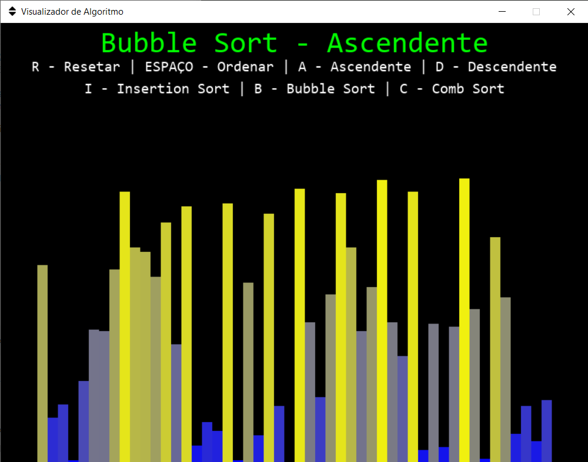
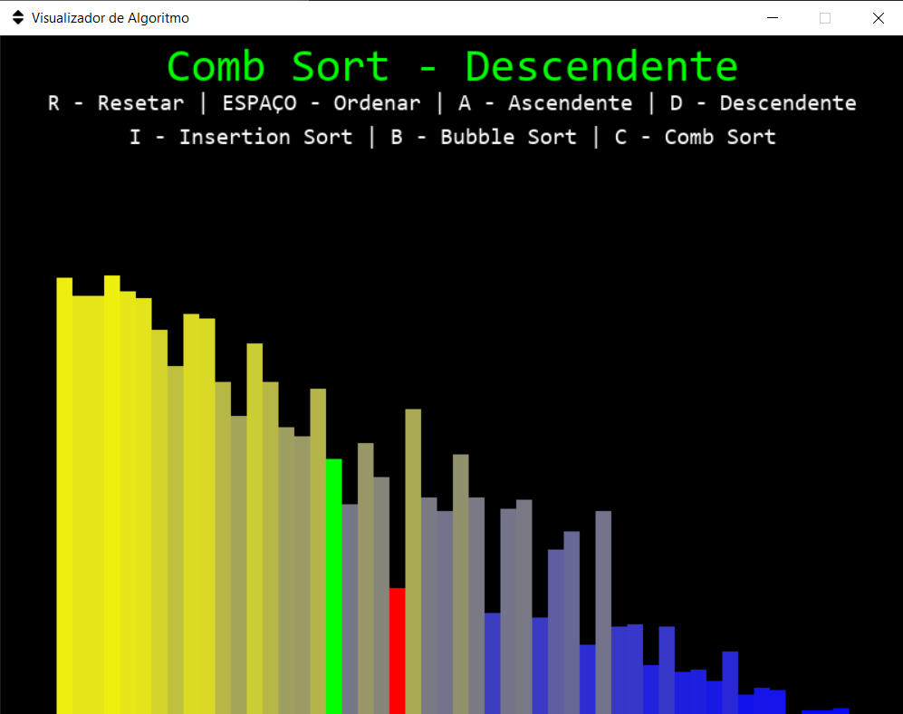
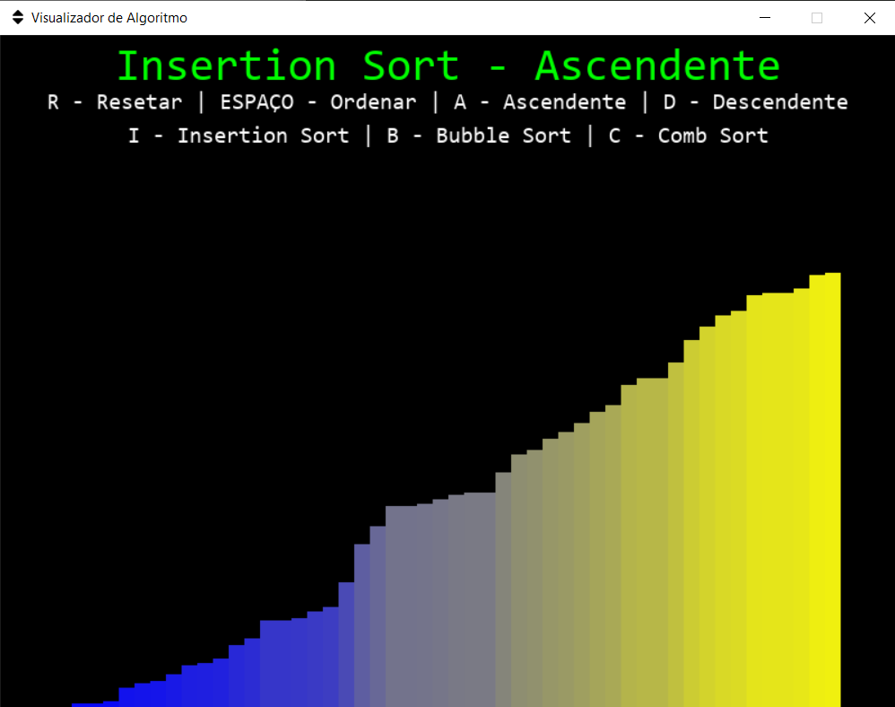

# Visualizador de Algoritmos

Aplicação desenvolvida utilizando a biblioteca *Pygame* que permite o usuário visualizar diversos algoritmos de ordenação funcionando em tempo real. também conta com cores e sons dinâmicos para melhorar a experiência do usuário. 

